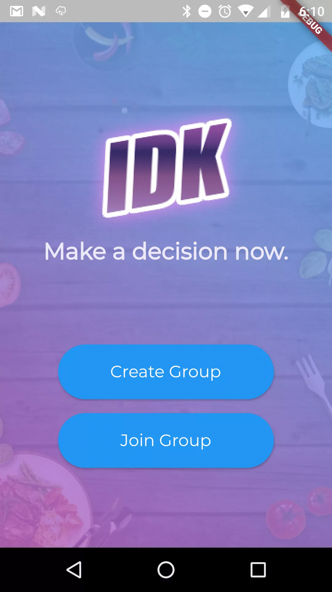
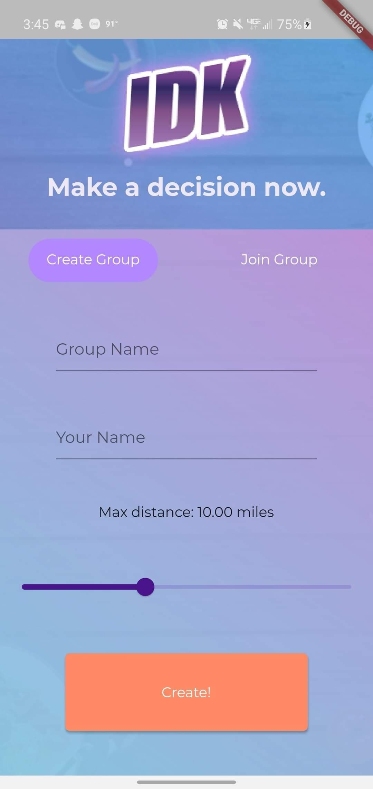

## Portfolio

---

### Projects [Block World](#block world)

#### Block World [github](https://github.com/kevinyluo/BlockWorld)

    
    

Fully interactive and dynamic block world written with WebGL and JavaScript. All objects are constructed using webGL triangles, and the lighting is calculated using the diffuse lighting model.

---

[IDK](https://github.com/nachiketingle/same_home_diff_hacks/tree/backend)

    
    

A mobile app for making decisions when in a group. Create a lobby and get your friends to join. Select categories for restuarants you're interested in (from yelp) and start swiping. At the end, the restuarant with the most "votes" will be displayed, so you decide whre to eat. I developed the back-end REST API for this project using Express and NodeJS.

---
